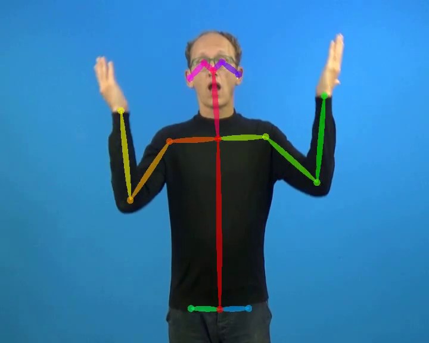
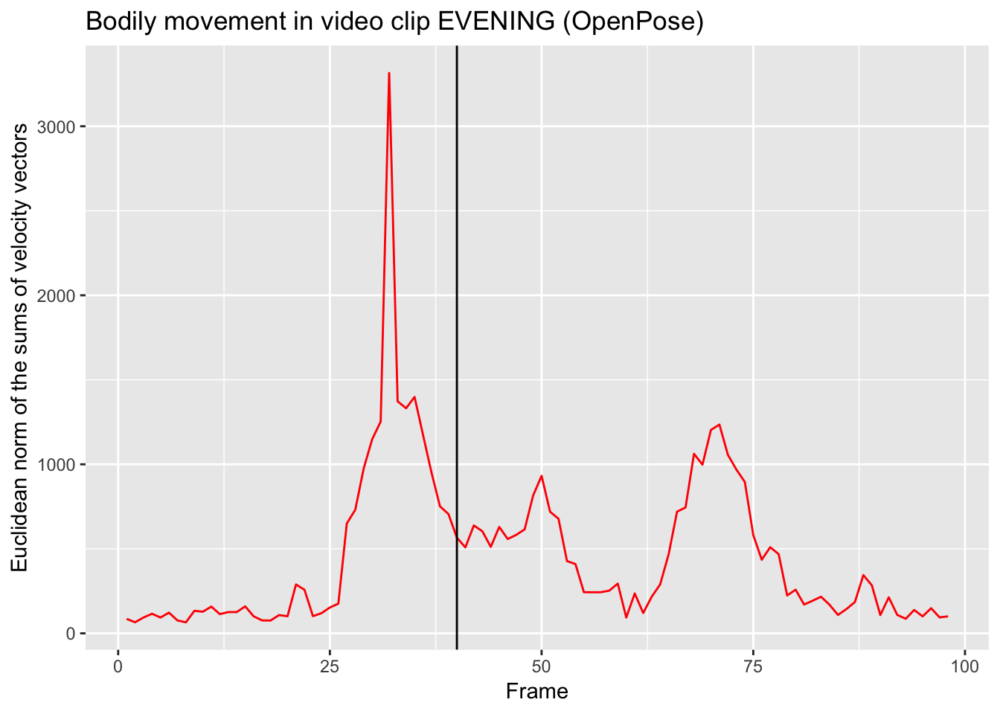

# OpenPoseR
An [R](https://www.r-project.org) package that provides some functions for analyzing motion-tracking data derived from video files using [OpenPose](https://github.com/CMU-Perceptual-Computing-Lab/openpose).

The original motivation for creating this package was to control video stimuli in sign language and gesture reserach, but the provided functionality may also be useful for other purposes.

## What is this?

<div style="float:right; margin:5px 5px 5px 5px; width:40%">
<figure style="width=40%">

<figcaption>Representative frame (nr. 40) from example video with fit "body25" body-pose model fit using [OpenPose](https://github.com/CMU-Perceptual-Computing-Lab/openpose).</figcaption>
</figure>
<figure style="width=40%">

<figcaption>OpenPoseR analysis of the data from the above clip. The black vertical line indicates the example frame above.</figcaption>
</figure>
</div>

OpenPoseR can be used to analyze motion-tracking data derived from video files using [OpenPose](https://github.com/CMU-Perceptual-Computing-Lab/openpose).

In other words, OpenPoseR does *not* provide any motion-tracking capabilities by itself. You will need to install and run OpenPose on your system first to perform the actual motion tracking analysis. Then, the OpenPoseR package provides a variety of R functions that can be used to analyse the output generated by OpenPose.

OpenPose is currently most sophisticated means for tracking people in video clips. Consequently, the results of motion-tracking of video clips with OpenPose can be used for further quantitiatve analysis that allows for quantification of movement paramters which are relevant to researchers working on sign language and gesture where bodily movements take on linguistic and/or discourse functions. 

## What's it for?

The original reason for developing OpenPoseR was to create a state-of-the-art means for controlling for the bodily motion occuring in different video clips showing a human being either signing or using gestures captured from the front (see frame from example video of the German Sign Language sign EVENING).

By quantifying the gross bodily movement of the person in a particular clip from this perspective it becomes possible to compare different clips of the same person that represent different conditions and determine their similiarty. In turn, this can be useful for quantitative stimulus control in sign language and gesture research. <!-- See [here]() for an example.-->

It must be pointed out here that this method *cannot* and was not intended to detect the subtle differences in hand configuration, path movement, as well as non-manual components that are linguistically meaningful and essential to sign languages. The situation may be a little less dim when it comes to gesture, but similar reservations apply.

For details on what OpenPoseR can (and can't) do, respectively, how you can use OpenPoseR see the [documentation](doc/DOC.md).

## Installation  

For now, OpenPoseR can be installed using the following commands (you will need to have the ``devtools`` package installed):

```r
# Install devtools from CRAN (if not already installed)
install.packages("devtools")

# Install OpenPoseR package from Github
devtools::install_github("trettenbrein/OpenPoseR")
```

## Creators

The OpenPoseR package was created at the [Max Planck Institute for Human Cognitive & Brain Sciences](https://www.cbs.mpg.de) by [Patrick C. Trettenbrein](http://trettenbrein.biolinguistics.eu) in collaboration with [Emiliano Zaccarella](https://www.cbs.mpg.de/employees/zaccarella) under the supervision of [Angela D. Friederici](https://www.cbs.mpg.de/employees/friederici).

If you have found a bug, please report it [here](https://github.com/trettenbrein/OpenPoseR/issues). In case you have any questions, criticism, or suggestions that do not belong into the bugtracker, please e-mail Patrick at [trettenbrein@cbs.mpg.de](mailto:trettenbrein@cbs.mpg.de).

## License

The code of this project is free for use by anyone without any liability or warranty under the conditions of the [GNU General Public License v3.0](https://github.com/trettenbrein/OpenPoseR/blob/master/LICENSE).
